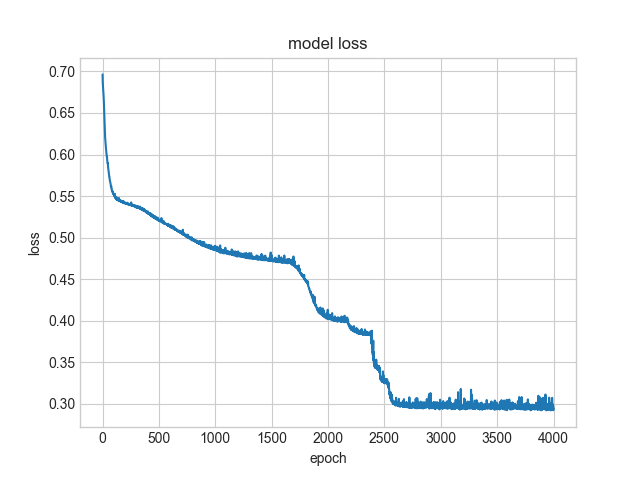
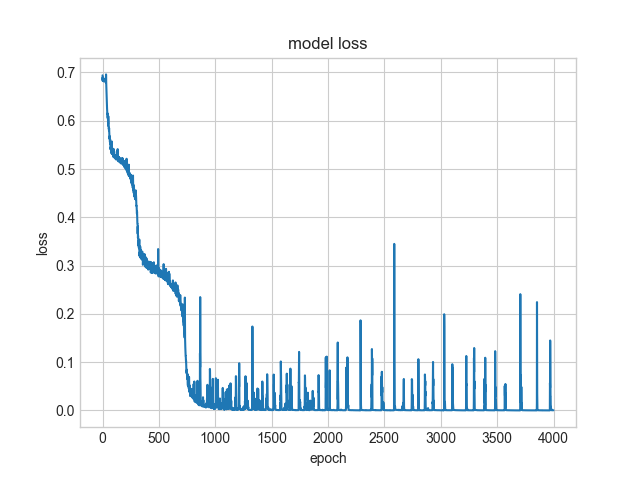

# Visualizing 2D fitting with Keras

I saw the following slide in the `MIT 6.S191: Convolutional Neural Networks` lesson, and wondered how fitting would look like. 

.
	 
Since this is actually a very simple 2D example, I decided to see how neural nets with different depth and "width" behaves while fitting -- Just for fun. So I decided to try to using Tensorflow. First I created the point sets `green_points.json` and `red_points.json` with a small HTML utitlity where I recorded points clicked.

.

Then I created the small script `train_dots.py`, and trained a small model of the form:

	def simple_model(inner_nodes, inner_layers):
	    input_layer = Input(shape=(2));
	    x = input_layer;
	    for i in range(inner_layers):
	        x = Dense(inner_nodes, activation='sigmoid')(x);
	    output_layer = Dense(2, activation='sigmoid')(x)
	    model = keras.models.Model(inputs=[input_layer], outputs=[output_layer])
	    model.compile(optimizer = 'adam' , loss = "binary_crossentropy", metrics=['accuracy'])
	    model.summary();
	    return model    

This will create a simple model consisting of a number of inner layers each with inner_nodes.

I then tried with:
	inner_layers in [1,2,3,4,6,8]
    inner_nodes in [2,4,8,16,32,64,128,256,384]

For each combination of above parameters I trained the model for 4000 epochs. I then create an image where each pixel is predicted for every 100th epoch (i.e. the image represents all points in the plane). I animate the images to create an animation of the fitting process. The results are in the table below (Final is the final image).
It looks like we need fewer nodes the more layers we have to get a decent looking fit. So 2 layers, 128 nodes, 3 layers 64 nodes, 4 layers 32 nodes all look like good fits. More layers doesn't seem to converge and a single layer doesn't seem sufficient at all. Adding more nodes with 2-4 layers, generally seem to cause faster conversion.

So in conclusion, it is indeed possible to fit a figure around these points, with a few layers and nodes, and about 2000 epochs. 

| Inner layers | nodes | Animation (sigmoid) |  Final (sigmoid) | Loss (sigmoid)   | Animation (relu) |  Final (relu) | Loss (relu)   | 
|--------------|-------|--------|--------|--------|--------|--------|--------|
| 1            |   2   | .     | .   | .   | .     | .   | .   | 
| 1            |   4   | .     | .   | .   | .     | .   | .   | 
| 1            |   8   | .     | .   | .   | .     | .   | .   | 
| 1            |   16  | .   | .  | .  | .   | .  | .  | 
| 1            |   32  | .   | .  | .  | .   | .  | .  | 
| 1            |   64  | .   | .  | .  | .   | .  | .  | 
| 1            |   128 | . | . | . | . | . | . | 
| 1            |   256 | . | . | . | . | . | . | 
| 1            |   384 | . | . | . | . | . | . | 
| 2            |   2   | .     | .   | .   | .     | .   | .   | 
| 2            |   4   | .     | .   | .   | .     | .   | .   | 
| 2            |   8   | .     | .   | .   | .     | .   | .   | 
| 2            |   16  | .   | .  | .  | .   | .  | .  | 
| 2            |   32  | .   | .  | .  | .   | .  | .  | 
| 2            |   64  | .   | .  | .  | .   | .  | .  | 
| 2            |   128 | . | . | . | . | . | . | 
| 2            |   256 | . | . | . | . | . | . | 
| 2            |   384 | . | . | . | . | . | . | 
| 3            |   2   | .     | .   | .   | .     | .   | .   | 
| 3            |   4   | .     | .   | .   | .     | .   | .   | 
| 3            |   8   | .     | .   | .   | .     | .   | .   | 
| 3            |   16  | .   | .  | .  | .   | .  | .  | 
| 3            |   32  | .   | .  | .  | .   | .  | .  | 
| 3            |   64  | .   | .  | .  | .   | .  | .  | 
| 3            |   128 | . | . | . | . | . | . | 
| 3            |   256 | . | . | . | . | . | . | 
| 3            |   384 | . | . | . | . | . | . | 
| 4            |   2   | .     | .   | .   | .     | .   | .   | 
| 4            |   4   | .     | .   | .   | .     | .   | .   | 
| 4            |   8   | .     | .   | .   | .     | .   | .   | 
| 4            |   16  | .   | .  | .  | .   | .  | .  | 
| 4            |   32  | .   | .  | .  | .   | .  | .  | 
| 4            |   64  | .   | .  | .  | .   | .  | .  | 
| 4            |   128 | . | . | . | . | . | . | 
| 4            |   256 | . | . | . | . | . | . | 
| 4            |   384 | . | . | . | . | . | . | 
| 6            |   2   | .     | .   | .   | .     | .   | .   | 
| 6            |   4   | .     | .   | .   | .     | .   | .   | 
| 6            |   8   | .     | .   | .   | .     | .   | .   | 
| 6            |   16  | .   | .  | .  | .   | .  | .  | 
| 6            |   32  | .   | .  | .  | .   | .  | .  | 
| 6            |   64  | .   | .  | .  | .   | .  | .  | 
| 6            |   128 | . | . | . | . | . | . | 
| 6            |   256 | . | . | . | . | . | . | 
| 6            |   384 | . | . | . | . | . | . | 
| 8            |   2   | .     | .   | .   | .     | .   | .   | 
| 8            |   4   | .     | .   | .   | .     | .   | .   | 
| 8            |   8   | .     | .   | .   | .     | .   | .   | 
| 8            |   16  | .   | .  | .  | .   | .  | .  | 
| 8            |   32  | .   | .  | .  | .   | .  | .  | 
| 8            |   64  | .   | .  | .  | .   | .  | .  | 
| 8            |   128 | . | . | . | . | . | . | 
| 8            |   256 | . | . | . | . | . | . | 
| 8            |   384 | . | . | . | . | . | . | 
